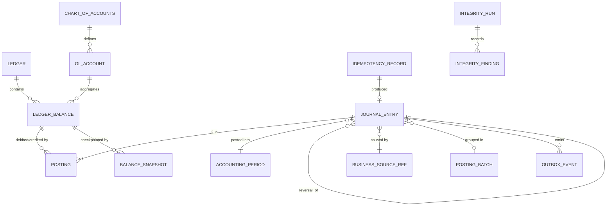

# Ledger Architecture

| | |
|---|---|
| **Purpose** | Design of the ledger kernel: data model, posting service, write path, projections, integrity machinery. |
| **Audience** | Engineering, reviewers, auditors. |
| **Owning phase** | Phase 0 (design) → Phase 3 (implementation; this doc must match code). |
| **Related** | [Accounting model](accounting-model.md) · [Invariants](invariants.md) · [Balance semantics](balance-semantics.md) · ADR-0003, 0004, 0006, 0007 · [BLNK matrix](../decisions/blnk-adoption-matrix.md) |

## Position

The ledger is the **kernel** of Next Core: an append-only, tenant-scoped, double-entry record
of value movements, with PostgreSQL as the sole authority (ADR-0003). Everything else in the
system exists to decide *whether and what* to post; the ledger decides *that it is posted
correctly, exactly once, and forever*.

Design lineage: BLNK's ledger/balance/transaction model (see adoption matrix) extended with
CoA, subledger→GL mapping, posting rules, accounting periods, value dates, and maker-checker —
the constructs a regulated institution requires.

## Core model



### Entities (implementation-level intent)

| Entity | Key fields (beyond ids/tenant/timestamps) | Notes |
|---|---|---|
| `Ledger` | name, base currency policy, CoA version ref | One or more per tenant (e.g., main + test) |
| `ChartOfAccounts` / `GLAccount` | code, name, type (ASSET/LIABILITY/INCOME/EXPENSE/EQUITY), normal_side, parent | Versioned; hierarchy for rollups |
| `LedgerBalance` | ledger ref, GL account ref, currency, owner ref (account/internal), normal_side, version (optimistic), projection fields | The store of value; projection fields listed in [balance-semantics](balance-semantics.md) |
| `JournalEntry` | entry seq, business source ref (type + id), accounting period, business date, value date, posted_at, reversal_of, batch ref, description, metadata | Immutable |
| `Posting` | entry ref, balance ref, direction (DEBIT/CREDIT), amount (bigint minor units), currency, seq within entry | Immutable; amount > 0 |
| `AccountingPeriod` | period code, status (OPEN/CLOSING/CLOSED), business-date range | Postings only into OPEN (close protocol in business_day docs) |
| `IdempotencyRecord` | scope (tenant, operation, client), key, request_hash, status, response ref, entry ref, expiry class | ADR-0006 |
| `OutboxEvent` | aggregate refs, event type+version, payload, status, attempts | ADR-0007 |
| `BalanceSnapshot` | balance ref, as-of entry seq, projected values, hash | Periodic checkpoint; speeds reconstruction; enables tamper evidence |
| `IntegrityRun` / `IntegrityFinding` | scope, started/finished, result, mismatch details | Persisted evidence |

### Database constraints (mandatory, Phase 3)

- `CHECK (amount > 0)`, `CHECK (direction IN ('DEBIT','CREDIT'))` on postings.
- **Balanced-entry enforcement**: per (entry, currency), Σdebits = Σcredits — deferred
  constraint trigger validated at commit. Application validates first; the DB is the backstop
  (invariant 23–24).
- `UNIQUE (tenant_id, scope, key)` on idempotency records.
- FK chain posting → entry → business source ref; **no `ON DELETE CASCADE`** anywhere in
  financial tables; UPDATE/DELETE revoked from the application role on posting & entry tables
  (append-only enforced at the grant level, not just convention).
- Period status checked at posting time (entry's period must be OPEN).

## The posting service — single write path

All financial writes flow through one application service:

```text
post_entries(tenant_ctx, source_ref, idempotency, entries_spec) -> PostingResult

Within ONE database transaction:
 1. Resolve tenant DB; open transaction.
 2. Idempotency gate: INSERT idempotency record
      ON CONFLICT -> load existing: same request_hash ? return stored result : 409 conflict.
 3. Validate specs: currency support, period OPEN, amounts > 0, per-currency balance,
    business/value date rules.
 4. Lock LedgerBalances: SELECT ... FOR UPDATE ordered by balance UUID (deterministic
    global order  -> no deadlocks between entry shapes).
 5. Enforce funds/constraint checks that depend on balances (available >= 0 unless
    overdraft policy; block states via accounts context callback contract).
 6. INSERT JournalEntry + Postings (append-only).
 7. UPDATE LedgerBalance projections (same transaction; the only legal balance write).
 8. INSERT OutboxEvent rows.
 9. Store response snapshot on the idempotency record.
10. COMMIT (deferred balanced-entry trigger fires here as backstop).
```

No other module may INSERT postings or UPDATE balances. Enforced by: code review rules
(`.claude/rules/ledger.md`), module boundaries, DB grants (separate role for the posting
path is an open implementation option, OD-14), and tests that grep/attempt forbidden paths.

## Reversals

`reverse(entry_id, source_ref, idempotency)` creates a mirror entry (same postings, flipped
directions) with `reversal_of` set, in the current OPEN period with its own business date;
the original is untouched. Partial corrections use compensating entries with explicit cause
linkage. The business layer (transactions context) governs *who/when*; the ledger guarantees
*linkage and immutability*.

## Balances: projection + reconstruction

- Projections updated only in-transaction with postings (above).
- `reconstruct_balances(scope)` recomputes from postings (optionally from latest snapshot +
  delta) and compares; mismatch ⇒ `IntegrityFinding`, alert, and **investigation before any
  further trust in the projection** — the postings are the truth.
- Snapshots are periodic (EoD) with hash chaining (entry seq range + hash of previous
  snapshot) for tamper evidence — design detail finalized in Phase 3 (OD-15).

## Multi-currency & FX bridge

Entries balance **per currency** (invariant 2). Cross-currency operations are modeled as two
balanced legs through FX position accounts with an `ExchangeRateReference` recorded on the
business transaction. MVP scope: same-currency operations + the bridge model defined; rate
management depth is OD-4.

## Hot balances

Strategy (validated by Phase 9 benchmarks): deterministic lock ordering + short transactions
first; for genuinely hot internal accounts (fees, settlement), hierarchical sub-balances
(N shards summed for reporting, settled internally at EoD) — never lock-free "eventual"
balances for available-funds checks. Details: [idempotency-concurrency](../architecture/idempotency-concurrency.md).

## Events

Ledger emits `journal_entry.posted`, `journal_entry.reversed`, `balance.updated` (projection
notification, explicitly non-authoritative), `integrity.mismatch` — via outbox only, after
commit (ADR-0007).

## What the ledger deliberately does NOT do

Fees, limits, product policy, customer semantics, approval workflows, external settlement —
these live in their contexts and arrive at the ledger as fully-specified entry specs from
posting rules. The kernel stays small enough to hostile-test exhaustively.
