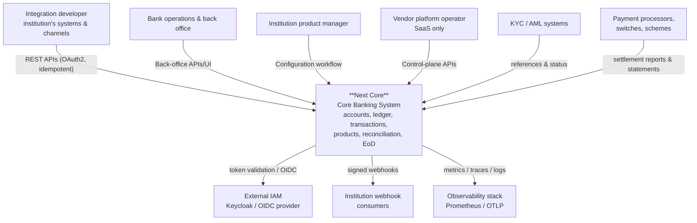
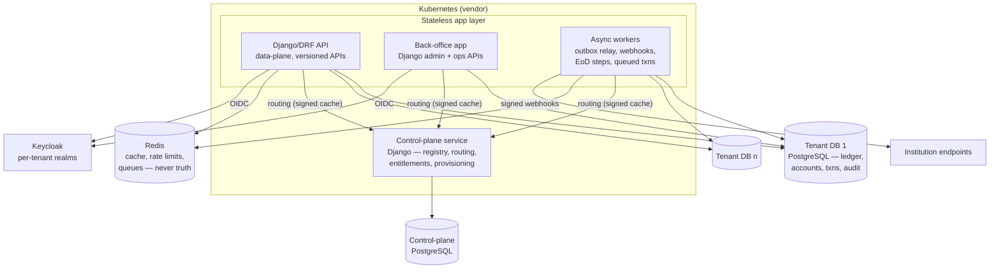

# C4 Architecture Diagrams

| | |
|---|---|
| **Purpose** | System context, container, and component views (C4). Context & container authored now; component diagrams land with their phases. |
| **Audience** | Everyone technical. |
| **Owning phase** | Phase 0 (context, container) → Phases 3+ (components) → Phase 9 (deployment). |
| **Related** | [Domain model](../domain/domain-model.md) · [Tenancy & deployment](tenancy-and-deployment.md) |

## Level 1 — System context

## Level 2 — Containers (shared SaaS profile)

On-premise profile: same API/BO/WK containers; control-plane service absent (static tenant
config); customer PostgreSQL/Redis/IAM. See [tenancy & deployment](tenancy-and-deployment.md).

## Level 3 — Components

Authored per phase, one section per context, matching the implementation (same-change rule):

- **Ledger & posting engine** — *Phase 3.* Posting service, idempotency gate, balance
  projector, outbox writer, integrity runner, reconstruction command.
- **Transaction orchestration** — *Phase 5.* Intake, lifecycle engine, hold manager,
  rule executor binding, simulation.
- **Tenancy & control plane** — *Phase 2.* Resolver, router, pool manager, fan-out migrator.
- **Configuration workflow** — *Phase 6.* Draft/review/approve engine, activation scheduler.
- **Business day & reconciliation** — *Phase 7.* EoD step framework, matching engine.

## Level 4 — Deployment diagrams

*Phase 9.* Reference topologies (shared SaaS, dedicated, on-premise, air-gapped) with network
zones, trust boundaries, and backup flows.

## Data-flow diagrams

*Phase 3+ per flow.* Transfer, hold capture, webhook delivery, EoD, reconciliation — each as a
sequence diagram in the owning context's component section, cross-referenced from the threat
model's trust-boundary analysis.
