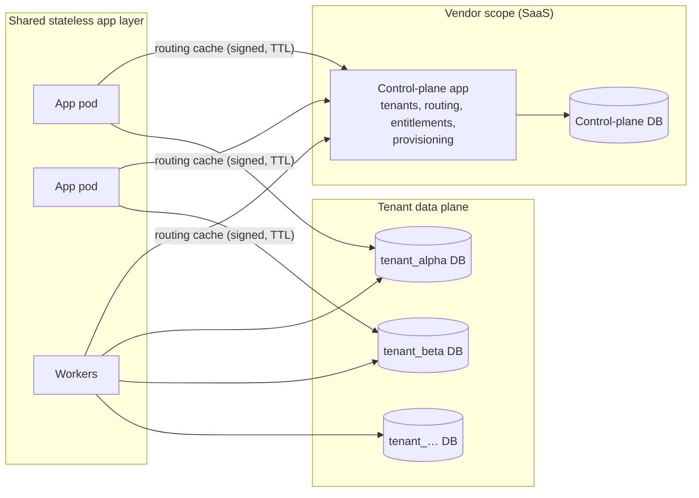

# Multi-Tenancy & Deployment Architecture

| | |
|---|---|
| **Purpose** | How one codebase serves shared SaaS, dedicated SaaS, and on-premise — and how tenants are isolated. |
| **Audience** | Engineering, SRE, security reviewers, prospective customers. |
| **Owning phase** | Phase 0 (design) → Phase 2 (tenancy) / Phase 9–10 (deployment hardening). |
| **Related** | ADR-0005 · [Threat model](../security/threat-model.md) · `.claude/rules/tenancy.md` |

## Isolation decision (ADR-0005 summary)

Evaluated: row-level (shared tables + tenant_id), schema-per-tenant, **database-per-tenant**.

**Decision: database-per-tenant for the financial data plane; separate control-plane
database.** Rationale: regulated financial records deserve physical isolation — blast-radius
containment, per-tenant backup/restore/residency/encryption, simpler audits, per-tenant
migration windows, and the on-premise profile (one tenant DB, no control plane) becomes a
trivial special case of the same model rather than a fork. Cost accepted: connection-pool
management, fan-out migrations, higher floor cost per tenant — mitigations below. Row-level
isolation was rejected for financial data (one WHERE-clause bug = cross-tenant breach);
schema-per-tenant rejected as sharing the failure domain and connection privileges of one DB
while keeping most of the operational burden.

## Architecture

### Tenant context & routing (implemented Phase 2 — modules in `src/next_core/tenancy/`)

Implementation map: `context.py` (contextvar `TenantContext`, no-default guarantee),
`router.py` (plane-separating DB router that **raises** on unscoped data-plane access),
`directory.py` (control-plane vs. static lookup + runtime alias registration),
`middleware.py` (boundary resolution, hard 400 `TENANT_RESOLUTION_FAILED`),
`management/commands/migrate_tenants.py` (fan-out). Current resolver strategies: `header`
(dev/test/staging behind a trusted gateway) and `static` (on-premise); production SaaS
host-/claim-based resolution lands with public routing (tracked as OD-21).

- `TenantContext` is established exactly once per request/job from explicit inputs (host/
  path/token claim per deployment config), validated against the tenant registry, and passed
  explicitly. **Resolution failure = hard error; no default tenant** (prohibited pattern).
- Routing map (tenant → DB DSN alias) is served by the control plane, cached in the app layer
  with signed, TTL-bound entries; the data-plane app holds per-tenant connection aliases with
  isolated pools (pool exhaustion of one tenant must not starve others — pool policy per
  tenant class).
- Every ORM access goes through tenant-scoped managers bound to the routed connection;
  unscoped access paths are lint/review/test-blocked.
- Migrations: fan-out runner applies per tenant DB with per-tenant status ledger, resumable,
  N-1 compatible (see `.claude/rules/migrations.md`).

### Control plane boundaries

Control plane stores **no financial data** and has **no connection** to tenant DBs' financial
schemas (provisioning uses a separate, audited bootstrap role that creates the DB/schema and
is not available to the control-plane runtime). Its writable scope: registry, profiles,
entitlements, routing, maintenance state, residency metadata, operational status.

## Deployment profiles (same artifacts everywhere)

| Aspect | Shared SaaS | Dedicated SaaS | On-premise |
|---|---|---|---|
| App layer | Shared stateless pods (K8s/Helm) | Dedicated deployment | Customer containers (compose/K8s) |
| Control plane | Vendor-run | Vendor-run | **Absent at runtime** — static single-tenant config file |
| Tenant DBs | One per tenant, vendor PostgreSQL | Dedicated instance | Customer-managed PostgreSQL supported |
| Encryption keys | Vendor KMS, per-tenant keys | Dedicated key material | Customer-managed secrets |
| IAM | Vendor Keycloak (per-tenant realm) | Dedicated realm/instance | Customer IAM (OIDC-compliant, configurable) |
| Observability | Vendor stack, per-tenant namespace | Dedicated namespace | Local integrations (Prometheus/OTLP endpoints configurable) |
| Backups | Vendor-managed, per-tenant | Dedicated | Local or S3-compatible target |
| Network | Vendor VPC | Dedicated | Proxy/restricted/air-gapped supported; zero vendor-cloud runtime dependency |
| Install | CD pipeline | CD pipeline | **Offline artifact bundle** (images + Helm/compose + checksums + SBOM), documented install/upgrade/rollback, health checks |

**Profile selection is configuration** (`NEXT_CORE_PROFILE=shared|dedicated|onprem`) wiring:
tenant-resolution strategy (registry vs. static), control-plane client (real vs. absent),
key/secret providers, observability exporters. No conditional business logic on profile —
prohibited-fork rule.

The on-premise profile is exercised in CI from Phase 2 (boot + serve + cross-tenant suite
with control plane absent), preventing SaaS-only drift.

## Tenant-specific behavior — allowed mechanisms only

Product configuration · policies · posting rules · feature entitlements · versioned
configuration · extension interfaces (`integrations` context: statement adapters, account-
number schemes, local identifier modules). **Never** tenant conditionals in core code, never
forks.

## Isolation assurance (continuous)

1. Cross-tenant test suite at every gate (tenant A token against tenant B's resources across
   every route: 404/403, no existence leaks).
2. No-implicit-tenant tests (resolution failure → hard error on every entry point: HTTP,
   worker, management command).
3. Static analysis: forbidden-pattern lint for unscoped managers/raw connections in data-plane
   code.
4. Runtime monitoring (Phase 9): per-connection tenant tagging; alert on any query against a
   tenant DB without matching context tag; audit of control-plane privileged operations.
5. Pen-test readiness item in control-readiness mapping (no self-certification claims).

## Capacity & scaling posture (initial hypotheses — see capacity model)

Shared SaaS targets small/mid tenants (≤ ~1M accounts each) with per-tenant DB vertical
scaling + read replicas for reporting; larger institutions go dedicated. Hot paths scale in
the app layer (stateless) and are bounded by per-tenant DB throughput — consistent with the
ledger's single-authority design. Numbers are validated in Phase 9 before any SLO commitment.
