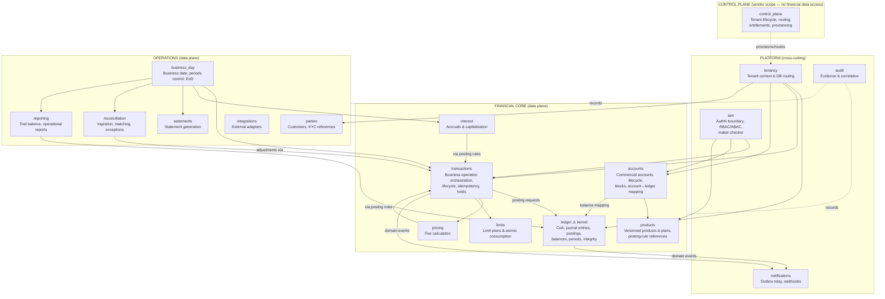

# Core Domain Model & Bounded Contexts

| | |
|---|---|
| **Purpose** | Define the bounded contexts, their responsibilities, ownership rules, and relationships. This is the module map of the modular monolith. |
| **Audience** | Engineering, architects, reviewers. |
| **Owning phase** | Phase 0 (refined as contexts are implemented). |
| **Related** | [Glossary](glossary.md) · [Repository structure](../architecture/repository-structure.md) · ADR-0001 |

## Context map

**Reading the arrows:** solid = allowed dependency direction (caller → callee via application
services/events). Anything not drawn is forbidden without an ADR.

## Golden dependency rules

1. **`ledger` is the kernel and depends on nothing** except `platform` primitives (money,
   time, ids) and `tenancy` context. No imports from products, accounts, or transactions.
2. **Only `transactions` calls the ledger's posting service.** Pricing, interest,
   reconciliation adjustments, EoD — all financial writes flow through a business transaction.
3. **`control_plane` never touches data-plane financial models** — enforced by module
   boundaries, separate DB, and tests.
4. Contexts communicate via **application-service interfaces** (synchronous, same process) or
   **domain events** (outbox) — never by importing another context's ORM models or querying
   its tables.
5. Cross-context references are **by immutable ID** (+ replicated read models where justified),
   not foreign keys across context schemas, except where a documented invariant needs DB
   enforcement (e.g., posting → journal entry within ledger).
6. `platform` (shared kernel: Money, TenantContext, ids, event base classes, clock) is the
   only shared code; it contains zero business policy.

## Context charters

### ledger — Ledger & Posting Engine ⚠️
- **Owns:** Ledger, CoA, GL accounts, LedgerBalance, JournalEntry, Posting, PostingRule
  *execution*, accounting periods, currencies & FX-rate references, reversal relationships,
  posting batches, balance projections & reconstruction, integrity records, idempotency
  records for postings, ledger outbox events.
- **Guarantees:** the 25 invariants; single posting service write path; per-currency balanced
  entries; immutability.
- **Never:** business policy (who may transfer), fees/limits decisions, customer concepts.

### transactions — Transaction Orchestration
- **Owns:** business transactions & lifecycle state machine, holds, idempotency at API
  operation scope, transaction simulation, scheduled/standing orders (Phase 8), reversal
  orchestration.
- **Flow:** validate (accounts context state, limits, pricing) → reserve/hold → invoke posting
  service with the entries from applicable posting rules → record refs → emit events.
- **Never:** direct posting inserts; balance math beyond delegating to ledger.

### accounts — Customer & Internal Accounts
- **Owns:** account contract, lifecycle & blocks, signatories, account-number generation
  schemes, account↔ledger-balance mapping, closure controls, dormancy state.
- **Never:** storing value (that's a ledger balance); posting.

### products / pricing / limits / interest
- `products` owns versioned product definitions and plan bindings; activation workflow
  (with `iam` maker-checker).
- `pricing` computes deterministic fee breakdowns (pure functions over plans).
- `limits` owns limit plans, counters, and **atomic** consumption (its own locked tables,
  consumed inside the same DB transaction as the posting — see idempotency-concurrency doc).
- `interest` owns rate plans, accrual computation & scheduling (posts via transactions).

### parties — Parties & Customers
- **Owns:** party registry, roles, relationships, beneficial owners, contacts, external KYC
  references, status/risk metadata. KYC orchestration is external; the ledger never depends
  on party internals — only stable party IDs.

### tenancy / control_plane / iam / audit / notifications
- `tenancy`: TenantContext, DB routing, per-tenant migration tooling. Data-plane-side.
- `control_plane`: tenant registry, profiles, entitlements, provisioning, release compat —
  separate DB, absent on-premise.
- `iam`: OIDC integration boundary, permission model, maker-checker engine, service accounts.
- `audit`: append-only evidence store + write API used by all contexts; correlation
  propagation helpers.
- `notifications`: outbox relay, webhook delivery (signing, retries, DLQ, replay), event
  catalog versioning.

### business_day / reconciliation / statements / reporting / integrations
- `business_day`: tenant business date, day open/close, period control, EoD orchestration
  (resumable step framework).
- `reconciliation`: ingestion adapters (via `integrations`), matching engine, exceptions,
  adjustment workflow (posts via `transactions` + maker-checker).
- `statements`: statement generation per product rules.
- `reporting`: trial balance & operational reports (read-only over ledger projections/postings).
- `integrations`: adapter framework for external systems (statement sources, IAM extras,
  local identifier schemes) — extension point that keeps forks away.

## Aggregate sketches (kernel)

| Aggregate | Root | Members | Key invariant at root |
|---|---|---|---|
| JournalEntry | JournalEntry | Postings (2..n) | Balanced per currency at commit; immutable after |
| LedgerBalance | LedgerBalance | projection fields | Only posting service mutates, in-transaction |
| BusinessTransaction | BusinessTransaction | state transitions, hold refs, entry refs | Legal state machine; append-only transitions |
| Account | Account | status, blocks, mappings | Block/closure rules atomic vs. posting checks |
| ProductVersion | Product | versions, plan refs | Active versions immutable |

Full entity-relationship detail: [`../accounting/accounting-model.md`](../accounting/accounting-model.md).

## Deferred contexts

Lending, cards, scheme connectivity: reserved names, no code. Their future extraction must
not require ledger changes — the ledger API (posting service + posting rules) is the stable
seam.
