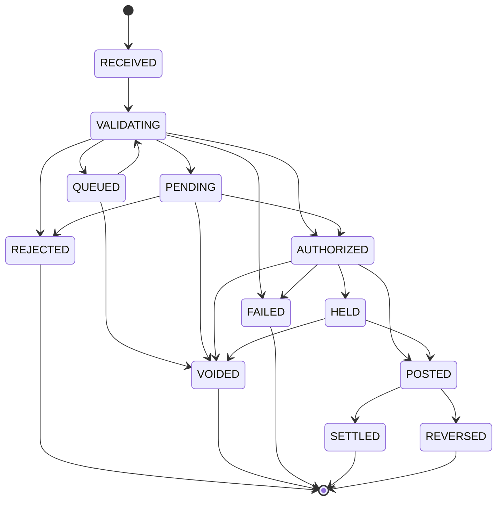

# Transaction Lifecycle Specification

| | |
|---|---|
| **Purpose** | The authoritative state machine for business transactions: states, transitions, actors, posting effects, terminality, audit, and recovery. |
| **Audience** | Engineering, API consumers, auditors. |
| **Owning phase** | Phase 0 (spec) → Phase 3/5 (implementation). |
| **Related** | [Balance semantics](../accounting/balance-semantics.md) · [Idempotency & concurrency](../architecture/idempotency-concurrency.md) · [Glossary](glossary.md) |

## Principles

1. States describe the **business transaction**, never the journal entry (entries are either
   committed or absent — they have no lifecycle).
2. State history is **append-only**: a `TransactionStateTransition` record per change (from,
   to, actor, reason, correlation ID, business date, timestamp). Current state is a
   projection of transitions.
3. Funds effects are explicit per state (reserved? posted?). No state implies postings
   "probably" exist.
4. Terminal states are final — no transitions out, ever. Corrections happen via **new**
   transactions (reversal/adjustment) linked to the original.
5. Not every operation type uses every state. Each operation type declares its permitted
   path(s) through the machine; anything else is rejected.

## States

| State | Meaning | Postings exist? | Funds reserved? | Terminal? |
|---|---|---|---|---|
| `RECEIVED` | Request accepted at API boundary, idempotency record created | No | No | No |
| `VALIDATING` | Sync validation running (account state, limits, pricing, funds check) | No | No | No |
| `REJECTED` | Failed validation/authorization — never had funds impact | No | No | **Yes** |
| `QUEUED` | Accepted, awaiting async execution (bulk/scheduled/throttled) | No | No | No |
| `PENDING` | Awaiting external/manual dependency (e.g. checker approval) | No | No | No |
| `AUTHORIZED` | Approved for execution; not yet executed | No | No | No |
| `HELD` | Funds reserved by an active hold (auth-capture flows) | No (hold record only) | **Yes** (held amount) | No |
| `POSTED` | Journal entries committed; economic effect applied | **Yes** | Converted to postings / released | No* |
| `SETTLED` | External settlement confirmed (settlement-bearing operations only) | Yes | — | **Yes** |
| `REVERSED` | A linked reversal transaction has offset this one | Yes (original + reversal entries) | — | **Yes** |
| `VOIDED` | Cancelled before any posting (from QUEUED/PENDING/AUTHORIZED/HELD) | No | Released if held | **Yes** |
| `FAILED` | Execution attempted and failed **without** committed postings | No (guaranteed) | Released if held | **Yes** |

\* `POSTED` is terminal for operations without settlement/reversal follow-up; it admits only
`→ SETTLED` and `→ REVERSED`.

## Transition table

| From → To | Trigger | Who may trigger | Audit evidence required |
|---|---|---|---|
| RECEIVED → VALIDATING | Automatic on intake | System | Request snapshot + idempotency record |
| VALIDATING → REJECTED | Validation failure | System | Machine-readable rejection code(s) |
| VALIDATING → AUTHORIZED | All checks pass (sync path) | System | Check results (funds, limits, state) |
| VALIDATING → PENDING | Maker-checker or external dependency required | System | Required-approval descriptor |
| VALIDATING → QUEUED | Async execution path selected | System | Queue partition + schedule |
| PENDING → AUTHORIZED | Approval granted | Checker (≠ maker), per permission | Approval record (approver, reason) |
| PENDING → REJECTED | Approval denied / expired | Checker or system (timeout) | Denial record |
| QUEUED → VALIDATING | Dequeued for execution | System (worker) | Worker + attempt id |
| AUTHORIZED → HELD | Hold placement (auth-capture ops) | System | Hold record (amount, expiry) |
| AUTHORIZED → POSTED | Direct execution (one-shot ops) | System (posting service) | Journal entry refs |
| HELD → POSTED | Capture (full/partial per op rules) | API client / system, per permission | Capture request + entry refs |
| HELD → VOIDED | Release / cancel | API client / system / expiry job | Release reason |
| AUTHORIZED/QUEUED/PENDING → VOIDED | Cancel before execution | Client or operator, per permission | Cancel reason |
| VALIDATING/AUTHORIZED → FAILED | Execution error with **certain** no-posting outcome | System | Error class + recovery note |
| POSTED → SETTLED | External settlement confirmation | Settlement/reconciliation process | Settlement reference |
| POSTED → REVERSED | Linked reversal transaction POSTED | API client / operator per permission (maker-checker for operator-initiated) | Reversal transaction ref (bidirectional link) |

Any transition not listed is illegal and must raise, be logged, and be audited as an attempted
illegal transition.

## Recovery & uncertainty rules

- **Crash between intake and commit:** on retry with the same idempotency key, the recorded
  state answers — `RECEIVED/VALIDATING` with no entry → re-execute safely; `POSTED` → return
  original result (ADR-0006).
- **Ambiguous execution (timeout during commit):** the transaction stays in its pre-posting
  state until the recovery sweep queries the ledger by (tenant, idempotency scope); it then
  transitions to `POSTED` (entry found) or `FAILED` (provably absent). `FAILED` is only
  assigned when no posting can exist — never as a guess.
- **Stuck non-terminal states** have per-state SLAs and sweep jobs (e.g., expired holds →
  VOIDED via expiry job; PENDING approvals → REJECTED at timeout). Sweeps are idempotent.
- **Worker death mid-QUEUED batch:** re-delivery is safe by idempotency; duplicate deliveries
  converge on one posting.

## Per-operation paths (MVP set)

| Operation | Path |
|---|---|
| Internal transfer (sync) | RECEIVED → VALIDATING → AUTHORIZED → POSTED |
| Transfer w/ approval | … VALIDATING → PENDING → AUTHORIZED → POSTED |
| Auth-capture (merchant) | … AUTHORIZED → HELD → POSTED (capture) or VOIDED (release/expiry) |
| Bulk item | RECEIVED → QUEUED → VALIDATING → … |
| Reversal | Own transaction: RECEIVED → VALIDATING → AUTHORIZED → POSTED; flips original to REVERSED |
| Adjustment (recon) | RECEIVED → VALIDATING → PENDING (maker-checker mandatory) → AUTHORIZED → POSTED |

## State diagram

## API mapping

API exposes the state verbatim plus: `is_terminal`, `funds_reserved`, `journal_entry_ids`,
`reversal_of` / `reversed_by`, and the transition history endpoint. Status polling is safe;
webhooks emit `transaction.state.changed` events (at-least-once, consumers dedupe on
transition id).
